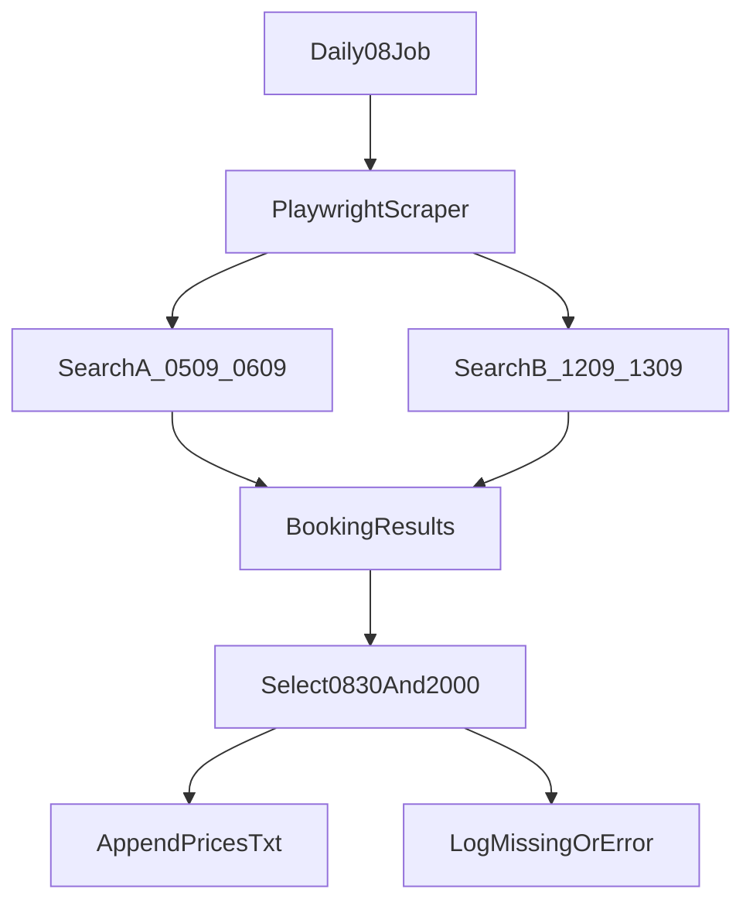

# Balearia Price Scraper Plan

## Scope
- Create a new single-purpose project in an empty workspace at `/home/jpizaf/code/ticket-price-checker`.
- Use `Bun + Playwright + TypeScript` because Baleària’s booking flow is dynamic and the target prices must be read from the live booking UI, and TypeScript will make selector/data handling safer to maintain.
- Run the scraper daily at `08:00` local time inside the Portainer container.
- Search with these fixed inputs:
  - Search 1: Alcudia -> Ciutadella, `05/09/2026` to `06/09/2026`
  - Search 2: Alcudia -> Ciutadella, `12/09/2026` to `13/09/2026`
  - `2` adult passengers, all marked `Residente`
  - `1` motorcycle `>50cc`
- Record only the sailing combination `08:30` outbound to Ciutadella and `20:00` return to Alcudia. If either sailing is missing for a search, write that explicitly in the output file instead of failing silently.

## Implementation
- Add project scaffolding in [package.json](/home/jpizaf/code/ticket-price-checker/package.json) with Bun-based scripts for local run and container start, plus TypeScript configuration in [tsconfig.json](/home/jpizaf/code/ticket-price-checker/tsconfig.json).
- Implement the browser automation in [src/scraper.ts](/home/jpizaf/code/ticket-price-checker/src/scraper.ts):
  - open `https://www.balearia.com/es`
  - accept cookies if shown
  - fill route, dates, passenger count, and vehicle data
  - enter the booking/results flow
  - enable the `Residente` option for all passengers when the booking UI exposes it
  - locate the `08:30` outbound and `20:00` return sailings
  - extract the displayed total price for that pair
- Add a small typed config module in [src/searches.ts](/home/jpizaf/code/ticket-price-checker/src/searches.ts) so the two searches are data-driven rather than hard-coded inline.
- Add output handling in [src/output.ts](/home/jpizaf/code/ticket-price-checker/src/output.ts) to append timestamped TXT entries under [data/prices.txt](/home/jpizaf/code/ticket-price-checker/data/prices.txt).
- Add defensive behavior for dynamic UI changes:
  - clear timeout/error messages in the TXT output
  - screenshot capture on failure under [data/screenshots/](/home/jpizaf/code/ticket-price-checker/data/screenshots/)
  - selectors grouped in one place so later fixes are localized
- Define shared TypeScript types for search input, sailing selection, and persisted result records in [src/types.ts](/home/jpizaf/code/ticket-price-checker/src/types.ts).

## Scheduling And Deployment
- Add a lightweight long-running scheduler in [src/index.ts](/home/jpizaf/code/ticket-price-checker/src/index.ts) using a Bun-compatible cron library instead of OS cron, to keep the container simpler in Portainer.
- Respect container timezone via `TZ` so `08:00` means your local server time.
- Add a container definition in [Dockerfile](/home/jpizaf/code/ticket-price-checker/Dockerfile) with Playwright Chromium dependencies.
- Add a Portainer-friendly stack file in [docker-compose.yml](/home/jpizaf/code/ticket-price-checker/docker-compose.yml) that:
  - mounts [data/](/home/jpizaf/code/ticket-price-checker/data/)
  - persists TXT history and screenshots
  - sets `TZ`
  - restarts automatically

## Verification
- Run the scraper once manually in the container before relying on the daily schedule.
- Verify that the TXT output distinguishes these outcomes per search:
  - exact sailing pair found with price
  - sailing pair not available
  - scraper error or selector drift
- Keep the first version focused on persistence to TXT only; notification hooks can be added later without changing the search flow.

## Notes And Constraints
- Baleària’s public help content indicates the resident discount applies to the passenger fare, not the motorcycle cost, unless a special TEA case applies. The scraper should therefore read the final displayed booking price rather than trying to calculate discounts itself.
- Exact September 2026 sailings are not reliably visible from public static pages, so the automation must validate live availability on each run.
- Bun will reduce runtime overhead for the app layer, but the main execution cost will still come from the Playwright browser session. The plan therefore keeps the scraper small and single-purpose instead of adding extra service layers.
- TypeScript should be executed directly with Bun where practical, keeping the build chain minimal unless Playwright or deployment constraints require a compile step.

